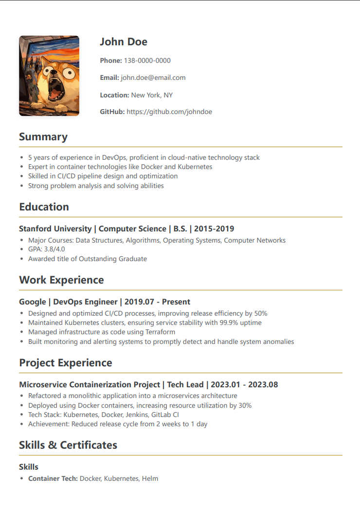

[中文](./README.md) | [Multi-language Guide](./MULTILANG.md)

# Ink-Resume

[](https://shields.io/)
[](https://opensource.org/licenses/MIT)
[](https://www.mycloudai.org/Ink-Resume/)

A concise and efficient online resume editor. It uses Markdown syntax, allowing you to create professional, beautiful, and print-friendly resumes with simple text markup. It supports real-time preview, multi-language switching, and rich custom printing options. Built with a template system architecture for easy maintenance and language expansion.

## ✨ Features

*   **Real-time Preview**: Type on the left, and instantly see the rendered resume on the right.
*   **Markdown Support**: Use simple and intuitive Markdown syntax (e.g., `###` for headings, `-` for lists) to format your resume content.
*   **Rich Print Settings**: Before printing, you can freely adjust page margins, overall scaling, title/content font sizes, and line height to achieve the best A4 print layout.
*   **Multi-language Support**: Built-in support for 7 languages with UI and default templates, switchable with a single click.
    - 🇨🇳 中文 (Chinese) - `index.html`
    - 🇺🇸 English - `en.html`  
    - 🇯🇵 日本語 (Japanese) - `ja.html`
    - 🇰🇷 한국어 (Korean) - `ko.html`
    - 🇫🇷 Français (French) - `fr.html`
    - 🇩🇪 Deutsch (German) - `de.html`
    - 🇪🇸 Español (Spanish) - `es.html`
*   **Data Import/Export**: Export your resume content to a `.yaml` file for backup, or restore from a file, making migration and version control easy.
*   **Drag & Drop Sorting**: Freely reorder sections like "Education" and "Work Experience" by dragging and dropping.
*   **Style Customization**: Support font selection (SimSun, Arial, etc.) and divider color customization with perfect print font adaptation.
*   **Template Architecture**: Single template generates multi-language versions for easy maintenance and language expansion.
*   **Automated Deployment**: Auto-build and deploy via GitHub Actions with GitHub Pages support.

## Resume sample


## 💻 How to Use

### 🌐 Online Use (Recommended)

Access the online version directly: **https://www.mycloudai.org/Ink-Resume/**

- Chinese version: `index.html` (default)
- English version: `en.html`

### 💽 Local Use

1. Download this project
2. Find the corresponding language HTML file in the directory:
   - `index.html` - Chinese version
   - `en.html` - English version
3. Simply open it with your browser (Chrome or Firefox recommended)

**No local server or dependencies required!**

### 🔧 Development and Build

If you want to modify templates or add new languages:

```bash
# Install Node.js dependencies (optional)
npm install

# After modifying template.html and i18n.js, rebuild
npm run build

# Or run directly
node build.js
```

## 🛠️ Tech Stack

*   **Core**: HTML, CSS, Vanilla JavaScript
*   **Build Tools**: Node.js (only for building multi-language versions)
*   **Deployment**: GitHub Actions + GitHub Pages
*   **Third-party Libraries**:
    *   [Marked.js](https://marked.js.org/): For parsing Markdown into HTML in real-time
    *   [js-yaml](https://github.com/nodeca/js-yaml): For handling `.yaml` data import and export

## 🌍 Multi-language Architecture

The project uses a template system to support multiple languages:

- `template.html` - Single HTML template
- `i18n.js` - Language configuration and translations
- `build.js` - Automated build script
- GitHub Actions for automated deployment

**Adding a new language takes only 3 steps**:
1. Add language configuration in `i18n.js`
2. Add corresponding translation content
3. Run `npm run build`

For detailed instructions, see: [Multi-language Guide](./MULTILANG.md)

## 📄 License

This project is licensed under the MIT License.