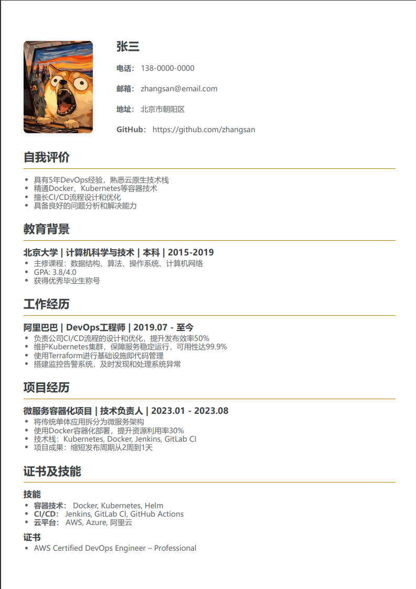

[English](./README.en.md) | [多语言系统说明](./MULTILANG.md)
---
# 一个免费的简历生成器，在线开始构建你的简历吧！用Yaml结合Git来管理你的简历！
---
# 墨客简历 (Ink-Resume)

[](https://shields.io/)
[](https://opensource.org/licenses/MIT)
[](https://www.mycloudai.org/Ink-Resume/)

一个简洁、高效的在线简历编辑器。它使用 Markdown 语法，允许你通过简单的文本标记来创建专业、美观且适合打印的简历。支持实时预览、多语言切换和丰富的自定义打印选项。采用模板系统架构，便于维护和扩展新语言。

## ✨ 主要功能

*   **模板系统**：内置多种专业模板（经典、现代、优雅等），一键切换，即时改变简历的整体外观。模板会影响字体、颜色、布局等，并能与自定义风格完美结合。
*   **实时预览**：在编辑器左侧输入，右侧即时看到最终简历的渲染效果。
*   **Markdown 支持**：使用简单直观的 Markdown 语法（如 `###` 创建标题，`-` 创建列表）来格式化你的简历内容。
*   **聚焦编辑模式**：为每个文本输入框提供独立的聚焦编辑模式，支持：
    *   点击文本框旁边的“📝”按钮或双击文本框进入。
    *   全屏沉浸式编辑体验。
    *   内容自动保存，并有状态提示。
    *   支持 `Ctrl+S` 快速保存。
    *   按下 `ESC` 键快速退出编辑模式。
    *   编辑模式标题会动态显示当前编辑部分的名称。
*   **丰富的打印设置**：在打印前，可以自由调整页边距、整体缩放、标题及正文字体大小和行距，以达到最佳的 A4 打印效果。
*   **多语言支持**：支持7种语言界面和默认模板，一键切换。
    - 🇨🇳 中文 (zh-CN) - `index.html`
    - 🇺🇸 English - `en.html`  
    - 🇯🇵 日本語 - `ja.html`
    - 🇰🇷 한국어 - `ko.html`
    - 🇫🇷 Français - `fr.html`
    - 🇩🇪 Deutsch - `de.html`
    - 🇪🇸 Español - `es.html`
*   **数据导入/导出**：可以将你的简历内容导出为 `.yaml` 文件进行备份，或从备份文件中恢复，方便迁移和版本管理。最新版本支持在导出数据中包含语言设置，导入时会自动切换到对应语言。
*   **自动保存与缓存管理**：编辑内容会自动保存到浏览器本地缓存，刷新页面不会丢失数据。提供“清理缓存”功能，可清除所有本地存储数据。
*   **模块拖拽排序**：通过拖放自由调整“教育背景”、“工作经历”等各个模块的顺序。
*   **风格自定义**：支持字体选择（宋体、Arial等）和分割线颜色自定义，打印字体完美适配。
*   **Tab 键支持**：在文本输入框中按下 `Tab` 键，会自动插入 4 个空格，而不是切换焦点，方便 Markdown 格式的编辑。
*   **技术支持与 Issue 模板**：页面顶部提供“技术支持”按钮，可直接跳转到 GitHub Issue 页面，并提供预设的 Bug Report、Feature Request 等模板，方便用户提交问题和建议。
*   **隐私保护**：所有内容（包括照片）仅在您的本地浏览器中处理，不会上传至任何服务器，请放心使用。

## 简历样例


## 💻 如何使用

### 🌐 在线使用（推荐）

直接访问在线版本：**https://www.mycloudai.org/Ink-Resume/**

- 🇨🇳 中文版本：`index.html`（默认）
- 🇺🇸 英文版本：`en.html`
- 🇯🇵 日语版本：`ja.html`
- 🇰🇷 韩语版本：`ko.html`
- 🇫🇷 法语版本：`fr.html`
- 🇩🇪 德语版本：`de.html`
- 🇪🇸 西班牙语版本：`es.html`

### 💽 本地使用

1. 下载本项目
2. 在文件目录中找到对应语言的HTML文件：
   - `index.html` - 🇨🇳 中文版本
   - `en.html` - 🇺🇸 英文版本
   - `ja.html` - 🇯🇵 日语版本
   - `ko.html` - 🇰🇷 韩语版本
   - `fr.html` - 🇫🇷 法语版本
   - `de.html` - 🇩🇪 德语版本
   - `es.html` - 🇪🇸 西班牙语版本
3. 直接用浏览器（推荐Chrome或Firefox）打开即可使用

**无需本地服务器，无需安装任何依赖！**

### 🔧 开发和构建

如果你想修改模板或添加新语言：

```bash
# 安装Node.js依赖（可选）
npm install

# 修改template.html和i18n.js后，重新构建
npm run build

# 或者直接运行
node build.js
```

## 🛠️ 技术栈

*   **核心**: HTML, CSS, 原生 JavaScript (Vanilla JS)
*   **构建工具**: Node.js (仅用于构建多语言版本)
*   **部署**: GitHub Actions + GitHub Pages
*   **第三方库**:
    *   [Marked.js](https://marked.js.org/): 用于将 Markdown 文本实时解析为 HTML
    *   [js-yaml](https://github.com/nodeca/js-yaml): 用于处理 `.yaml` 格式的数据导入和导出

## 🌍 多语言架构

项目采用模板系统支持多语言：

- `template.html` - 单一HTML模板
- `i18n.js` - 语言配置和翻译
- `build.js` - 自动构建脚本
- GitHub Actions自动化部署

**添加新语言只需3步**：
1. 在`i18n.js`中添加语言配置
2. 添加对应翻译内容  
3. 运行`npm run build`

详细说明请参考：[多语言系统说明](./MULTILANG.md)

## 📄 许可证

该项目采用 MIT 许可证。
